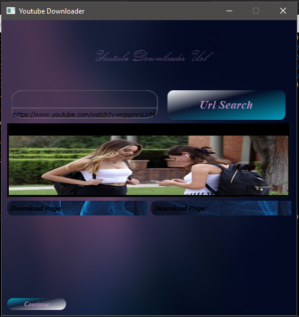
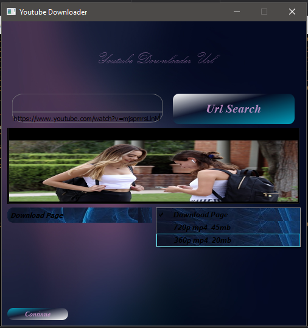
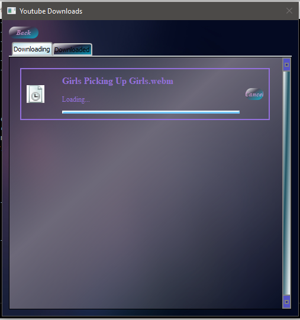
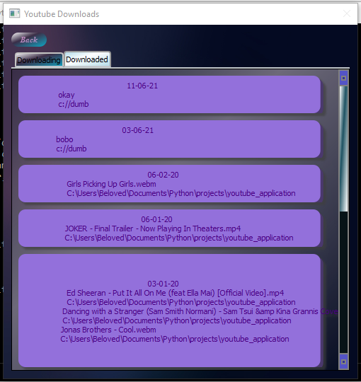

## Youtube Desktop Interface

This is a simple interface which currently use pytube Youtube Core implementation
as its Youtube library and uses PyQt5 as the Desktop GUI library.

Work is ongoing with switching from pytube to its own native youtube 
library which is written in c++ language.

### Currently Implemented Features
* [1. Audio and Video Downloads](#download)
* [2. History View](#history)

### Screenshots

## 

## 
